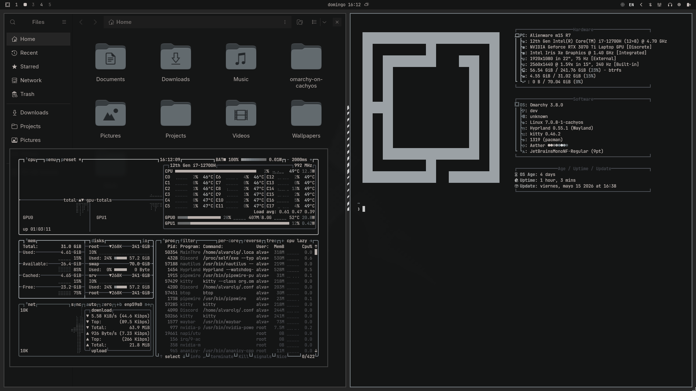
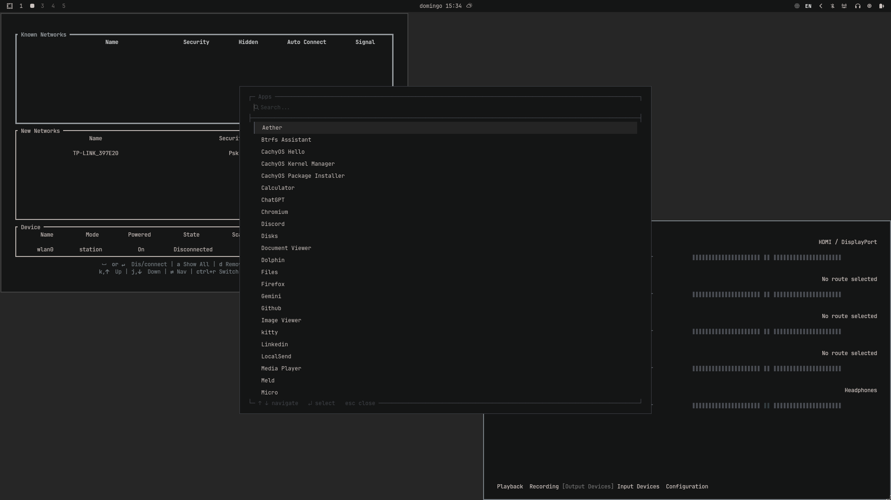

<div align="center">

<br/>

```
░█████╗░███████╗████████╗██╗░░██╗███████╗██████╗░
██╔══██╗██╔════╝╚══██╔══╝██║░░██║██╔════╝██╔══██╗
███████║█████╗░░░░░██║░░░███████║█████╗░░██████╔╝
██╔══██║██╔══╝░░░░░██║░░░██╔══██║██╔══╝░░██╔══██╗
██║░░██║███████╗░░░██║░░░██║░░██║███████╗██║░░██║
╚═╝░░╚═╝╚══════╝░░░╚═╝░░░╚═╝░░╚═╝╚══════╝╚═╝░░╚═╝
```

### omarchy-tui-theme

*A full TUI/terminal aesthetic for [Omarchy](https://github.com/basecamp/omarchy) — dark, sharp, monospaced.*

<br/>

[](https://github.com/basecamp/omarchy)
[](https://github.com/alvarolg/omarchy-tui-theme)
[](LICENSE)

<br/>



<br/>

</div>

---

## ⚡ Quick Install

```bash
git clone https://github.com/alvarolg/omarchy-tui-theme
cd omarchy-tui-theme
./install.sh
```

> **Requires** [Omarchy](https://github.com/basecamp/omarchy) to be installed first.

---

## ✨ Features

<table>
<tr>
<td width="50%" valign="top">

### 🎨 Aether Colorscheme

Dark, desaturated, and warm. Applied consistently across every app.

| Swatch | Role | Hex |
|--------|------|-----|
|  | Background | `#141515` |
|  | Foreground | `#cbc2be` |
|  | Accent | `#798186` |
|  | Border | `#4b4e55` |

Covers: Alacritty · Ghostty · Kitty · Hyprland · Hyprlock · Mako · Btop · Neovim · VSCode · Waybar · Walker · Wofi · Chromium · Zellij · Warp · Zed · Vencord · SwayOSD

</td>
<td width="50%" valign="top">

### 🪟 TUI Walker Menus

Pure terminal aesthetic on both launchers.

```
┌─ Apps ───────────────────────────────┐
│  Search...                           │
├──────────────────────────────────────┤
│  ▌ Firefox                           │
│  Chromium                            │
│  Kitty                               │
│  ...                                 │
└─ ↑ ↓ navigate  ↵ select  esc close ─┘
```

- Box-drawing borders with embedded titles
- Separator line between search and results
- Keybind legend baked into the bottom border
- JetBrainsMono Nerd Font · No border-radius

</td>
</tr>
<tr>
<td width="50%" valign="top">

### 📊 Waybar

Full status bar in the same TUI language.

- JetBrainsMono Nerd Font throughout
- Sharp edges, no border-radius anywhere
- Modules: workspaces · clock · weather · CPU · battery · audio · bluetooth · network · tray · VPN · keyboard · screen recording · idle
- Custom Omarchy logo button
  - Left-click → Omarchy menu
  - Right-click → terminal

</td>
<td width="50%" valign="top">

### 🖥️ Screensaver

Custom ASCII art splash via `omarchy-branding-screensaver`.

```bash
# Edit your ASCII art
omarchy branding screensaver text

# Generate from image
omarchy branding screensaver image

# Reset to default
omarchy branding screensaver reset
```

> The included `screensaver.txt` has **my name**. Replace it with yours.

</td>
</tr>
</table>

---

## 📸 Screenshots

<div align="center">

**Apps Launcher** — `SUPER + SPACE`



</div>

---

## ⌨️ Shortcuts

| Shortcut | Action |
|----------|--------|
| `SUPER + SPACE` | Apps launcher (`omarchy-default` theme) |
| `SUPER + ALT + SPACE` | Omarchy system menu (`omarchy-menu` theme) |

---

## 🔧 Manual Installation

<details>
<summary><strong>Step by step (click to expand)</strong></summary>

<br/>

### 1. Aether theme
```bash
cp -r theme/aether ~/.config/omarchy/themes/aether
omarchy theme set aether
```

### 2. Walker TUI themes
```bash
cp -r walker/themes/omarchy-default ~/.config/walker/themes/
cp -r walker/themes/omarchy-menu    ~/.config/walker/themes/
cp -r walker/themes/omarchy-apps    ~/.config/walker/themes/
```

### 3. Walker config
> ⚠️ Replaces your existing `~/.config/walker/config.toml`
```bash
cp walker/config.toml ~/.config/walker/config.toml
```

### 4. Walker override
```bash
cp overrides/omarchy-launch-walker ~/.config/omarchy/overrides/
chmod +x ~/.config/omarchy/overrides/omarchy-launch-walker
```

### 5. Screensaver branding
```bash
cp branding/screensaver.txt ~/.config/omarchy/branding/screensaver.txt
```

### 6. Waybar
> ⚠️ Replaces your existing Waybar config entirely
```bash
mkdir -p ~/.config/waybar
cp waybar/style.css    ~/.config/waybar/
cp waybar/config.jsonc ~/.config/waybar/
```

</details>

---

## 📁 File Structure

<details>
<summary><strong>View full tree</strong></summary>

<br/>

```
omarchy-tui-theme/
├── branding/
│   └── screensaver.txt              # ASCII art splash (replace with yours)
├── overrides/
│   └── omarchy-launch-walker        # Forces omarchy-menu TUI theme in dmenu mode
├── screenshots/
│   ├── apps-launcher.png            # Apps launcher screenshot
│   └── desktop-overview.png         # Full desktop screenshot
├── theme/
│   └── aether/
│       ├── backgrounds/
│       │   └── wallpaper.jpg        # Desktop wallpaper
│       ├── preview.png              # Omarchy theme picker preview
│       ├── aether.zed.json          # Zed editor theme
│       ├── alacritty.toml           # Alacritty terminal colors
│       ├── btop.theme               # Btop resource monitor theme
│       ├── chromium.theme           # Chromium browser theme
│       ├── colors.toml              # Master color palette
│       ├── ghostty.conf             # Ghostty terminal colors
│       ├── gtk.css                  # GTK stylesheet
│       ├── hyprland.conf            # Hyprland compositor config
│       ├── hyprlock.conf            # Hyprlock screen lock config
│       ├── icons.theme              # Icon theme
│       ├── kitty.conf               # Kitty terminal colors
│       ├── mako.ini                 # Mako notification daemon
│       ├── neovim.lua               # Neovim colorscheme
│       ├── swayosd.css              # SwayOSD overlay stylesheet
│       ├── vencord.theme.css        # Vencord (Discord) theme
│       ├── vscode.json              # VS Code color theme
│       ├── walker.css               # Walker launcher stylesheet
│       ├── warp.yaml                # Warp terminal theme
│       ├── waybar.css               # Waybar stylesheet
│       ├── wofi.css                 # Wofi launcher stylesheet
│       └── zellij.kdl               # Zellij terminal multiplexer theme
├── walker/
│   ├── config.toml                  # Walker config (theme, keybinds, providers)
│   └── themes/
│       ├── omarchy-default/         # Apps launcher (SUPER+SPACE)
│       │   ├── layout.xml
│       │   └── style.css
│       ├── omarchy-menu/            # Omarchy menu (SUPER+ALT+SPACE)
│       │   ├── layout.xml
│       │   └── style.css
│       └── omarchy-apps/            # Alternative sectioned apps layout
│           ├── layout.xml
│           └── style.css
└── waybar/
    ├── config.jsonc
    └── style.css
```

</details>

---

## 📦 Dependencies

| Dependency | Purpose |
|------------|---------|
| [Omarchy](https://github.com/basecamp/omarchy) | Base system (required) |
| [Walker](https://github.com/abenz1267/walker) | Application launcher |
| [Waybar](https://github.com/Alexays/Waybar) | Status bar |
| [Hyprland](https://hyprland.org) + [Hyprlock](https://github.com/hyprwm/hyprlock) | Compositor + lock screen |
| JetBrainsMono Nerd Font | Typography |

---

<div align="center">

Built with ♥ on top of [Omarchy](https://github.com/basecamp/omarchy) by Basecamp

<br/>

> The wallpaper (`theme/aether/backgrounds/wallpaper.jpg`) is a personal image — replace it with your own before using.

</div>

